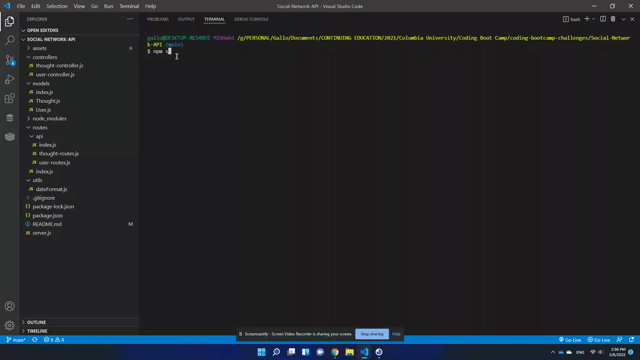

# Challenge 18: NoSQL-Social Network API

# Activity Instructions:

Build an API for a social network web application where users can share their thoughts, react to friends’ thoughts, and create a friend list. 

## Links

* 💾 [Repo](https://github.com/gallolopez1/Social-Network-API)

## <u>Social Network API Preview:</u>

### App Usage

The following animations show examples of the application's API routes being tested in Insomnia.

* The following animation shows how to start the application’s server and how to GET routes to return all users and all thoughts being tested in Insomnia:


[Recording Link](https://watch.screencastify.com/v/UUUvh3nTplvCx9b9P5d7)

* The following animation shows GET routes for a single user and a single thought being tested in Insomnia:


[Recording Link](https://watch.screencastify.com/v/jbZU7mnM9R6FHxUZYDfS)

* The following animation shows POST, PUT, and DELETE routes for users being tested in Insomnia:


[Recording Link](https://watch.screencastify.com/v/Q694h7WJ9JUG1kDbTCsf)

* The following animation shows POST, PUT, and DELETE routes for thoughts being tested in Insomnia:


[Recording Link](https://watch.screencastify.com/v/R4iwJtHZHhD6UoujZtAc)

* The following animation shows POST and DELETE routes for a user’s friend list being tested in Insomnia:


[Recording Link](https://watch.screencastify.com/v/QhXqgfOss89Z7jIaXubk)

* The following animation shows POST and DELETE routes for reactions to thoughts being tested in Insomnia:


[Recording Link](https://watch.screencastify.com/v/NBxp20QYajXljaCWipzN)

## User Story

```
AS A social media startup
I WANT an API for my social network that uses a NoSQL database
SO THAT my website can handle large amounts of unstructured data
```

## Acceptance Criteria

```
GIVEN a social network API
WHEN I enter the command to invoke the application
THEN my server is started and the Mongoose models are synced to the MongoDB database
WHEN I open API GET routes in Insomnia for users and thoughts
THEN the data for each of these routes is displayed in a formatted JSON
WHEN I test API POST, PUT, and DELETE routes in Insomnia
THEN I am able to successfully create, update, and delete users and thoughts in my database
WHEN I test API POST and DELETE routes in Insomnia
THEN I am able to successfully create and delete reactions to thoughts and add and remove friends to a user’s friend list
```
## References:
https://nodejs.org/api/fs.html

https://www.npmjs.com/package/express

https://www.npmjs.com/package/mongoose

https://www.mongodb.com/